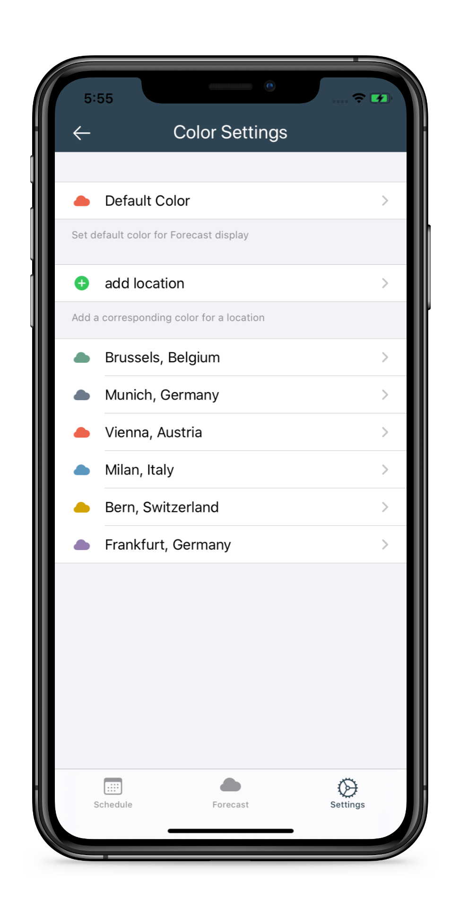
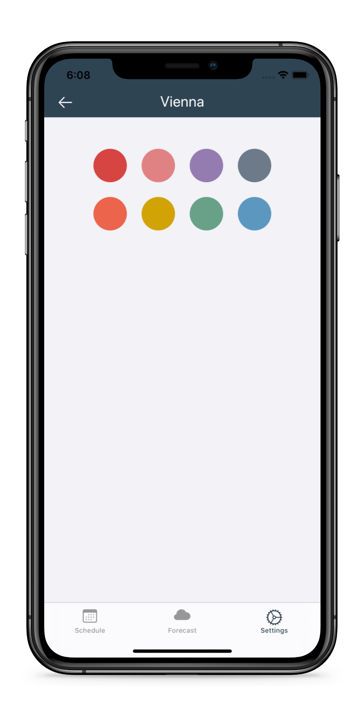

<h1 align="left">Travel Weather</h1>

<h2>Introduction</h2>

<p align="left">Effortlessly plan for your next roadtrip or multi-destination vacation with Travel Weather. Input your schedule, then view your personalized 14-day Forecast in one simple display. Built for iOS using Swift.</p>

<p align="center"> </p>

## Table of Contents 
* [Introduction](#introduction) <br />
* [Features](#features)
    * [Scheduling](#scheduling)
    * [Forecast](#forecast)
    * [Customization](#customization)
* [Built Using](#built-using)

## Features
### Scheduling
In the Schedule tab, select date or range of dates, then search for a location. Scroll down in table to view all dates within your selected range. Schedule up to one year in advance. Dates you've scheduled will have a yellow dot indicator.

<p align="center">    </p>

### Forecast
In the Forecast tab, view your next 14 days of weather based on your schedule. If you haven't entered a location for a certain day your default location will be used.

<p align="center">    </p>

### Customization
In the Settings tab, set your default location, switch between Fahrenheit and Celsius, and set colors for locations.

<p align="center">    </p>

## Built Using
* Swift 5
* Core Data
* [JTAppleCalendar](https://github.com/patchthecode/JTAppleCalendar) - Awesome customizable iOS calendar library written in Swift
* [Google Places SDK for iOS](https://developers.google.com/places/ios-sdk/intro) - for location search
* [Dark Sky API](https://darksky.net/dev) - for weather data

## Requirements

## Installation
IMPORTANT: Travel Weather uses [Dark Sky API](https://darksky.net/dev), which is [no longer accepting new signups](https://blog.darksky.net/dark-sky-has-a-new-home/). Therefore, you can only run Travel Weather in its current form if you've already signed up with Dark Sky. I plan to transition to a different weather API in the near future.

#### CocoaPods:
```
git clone https://github.com/sajedian/travel-weather.git
pod install
```

#### Provide API Keys:
[Sign up for a Google Maps API Key](https://developers.google.com/places/ios-sdk/get-api-key)
<p>Add a file called Constants.swift (or whatever you'd like to call it), with the following constants:</p>

```Swift
let darkSkyAPIKey = "your_key_here"
let googleMapsAPIKey = "your_key_here"
```

## License
Travel Weather is available under the MIT license. See the LICENSE file for more info.


