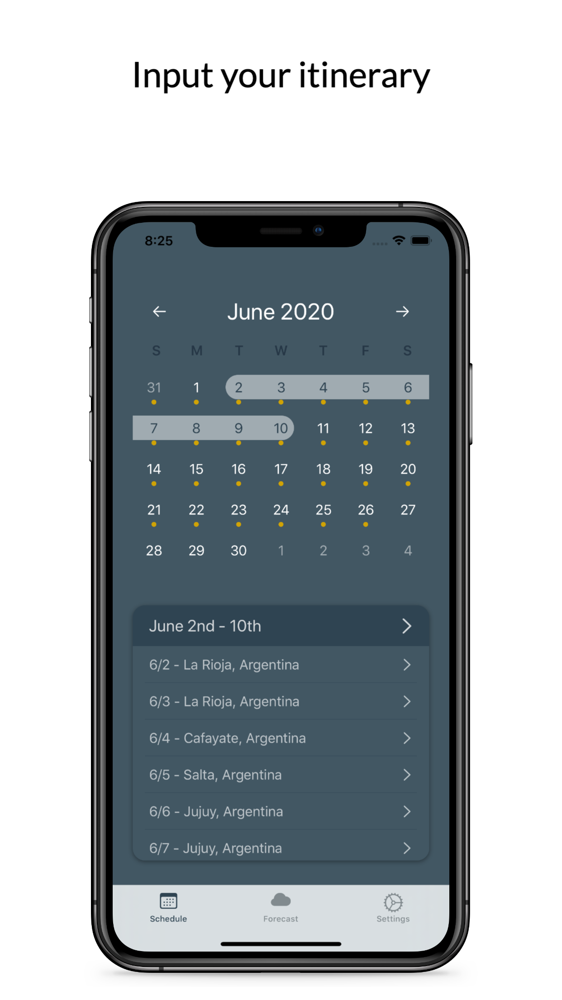

<h1 align="left">Travel Weather</h1>

<h2>Introduction</h2>

Effortlessly plan for your next roadtrip or multi-destination vacation with Travel Weather. Input your schedule, then view your personalized 14-day Forecast in one simple display.

 

## Table of Contents 
* [Introduction](#introduction)  
* [Features](#features)
    * [Scheduling](#scheduling)
    * [Forecast](#forecast)
    * [Customization](#customization)
* [Built Using](#built_using)

## Features
### Scheduling
In the Schedule tab, select date or range of dates, then search for a location. Scroll down in table to view all dates within your selected range. Schedule up to one year in advance. Dates you've scheduled will have a yellow dot indicator.

    

### Forecast
In the Forecast tab, view your next 14 days of weather based on your schedule. If you haven't entered a location for a certain day your default location will be used.

    

### Customization
In the Settings tab, set your default location, switch between Fahrenheit and Celsius, and set colors for locations.

    

## Built Using
* [JTAppleCalendar](https://github.com/patchthecode/JTAppleCalendar)
* 

