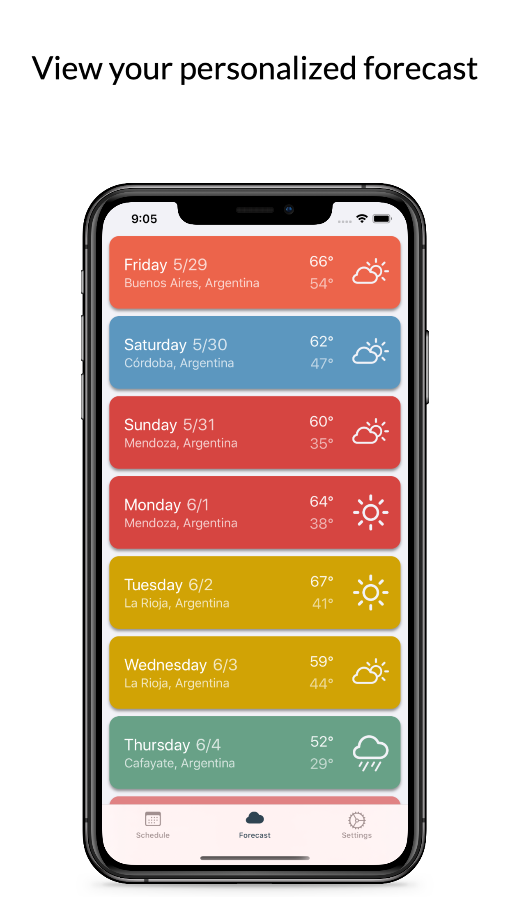

<h1 align="left">Travel Weather</h1>

<h2>Introduction</h2>

Effortlessly plan for your next roadtrip or multi-destination vacation with Travel Weather. Input your schedule, then view your personalized 14-day Forecast in one simple display.

 

## Table of Contents 
* [Introduction](#introduction)  
* [Features](#features)  

## Features
### Scheduling
Select date or range of dates then search for a location

  

